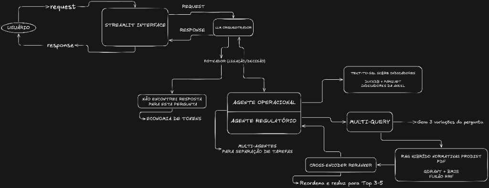

# PowerReg Copilot

Copiloto de IA especializado no setor elétrico, desenvolvido para auxiliar na consulta e análise de normativas regulatórias da ANEEL, como o PRODIST e a REN ANEEL nº 1.000/2021, combinando **RAG híbrido + re-ranking + arquitetura multi-agente.**

O sistema permite consultar as normas em linguagem natural, encontrando informações relevantes em documentos regulatórios extensos, além de realizar consultas sobre **dados operacionais estruturados**. Um agente roteador identifica automaticamente o tipo de solicitação e direciona a pergunta para o agente especializado.

Por exemplo:

• "O que é o indicador DIC?"

• "Quando a distribuidora deve compensar o consumidor por violação do DIC?"

• "Quais são os limites para compensação por violação dos indicadores de continuidade?"

• "Qual foi o valor médio do indicador DEC em 2020?"

A arquitetura combina **busca semântica (Dense Retrieval), busca lexical com BM25, Hybrid Search com RRF, re-ranking, Qdrant, LangGraph e Groq**, permitindo respostas fundamentadas no contexto recuperado e com referência à normativa, módulo e página.




---

## Visão Geral

| Tipo de pergunta | Exemplo | Agente responsável |
|---|---|---|
| **Regulatória** | "Quais os requisitos de proteção para subestações de MT/AT?" | `regulatory_agent` (RAG + Qdrant + BM25 + Reranker) |
| **Operacional** | "Qual a média do FEC da distribuidora CEA em 2021?" | `operations_agent` (Text-to-SQL via DuckDB) |

Um **agente roteador** (LLM com temperatura 0) classifica a intenção da pergunta e direciona o fluxo para o especialista correto, dentro de um grafo de orquestração (`CopilotOrchestrator`).

### Busca Híbrida (RAG)

A busca regulatória combina duas estratégias de recuperação, fundidas manualmente via **Reciprocal Rank Fusion (RRF)**:

1. **Busca densa (semântica)** — embeddings via `sentence-transformers/paraphrase-multilingual-MiniLM-L12-v2` (384 dimensões), indexados no **Qdrant**.
2. **Busca lexical (BM25)** — via `rank_bm25`, com tokenização customizada para português.
3. **Fusão RRF** — combina os rankings das duas fontes (`RRF_K = 60`, conforme Cormack et al., 2009).
4. **Reranking** — os candidatos combinados passam por um **Cross-Encoder** (`BAAI/bge-reranker-v2-m3`) para reordenação final por relevância semântica real.

### Avaliação de Desempenho (Reranker)

A adição do Cross-Encoder ao pipeline de busca híbrida (após a fusão RRF) apresentou ganhos consistentes na qualidade de recuperação dos documentos regulatórios. Abaixo estão as métricas fundamentais da avaliação (considerando Top-3 resultados):

| Métrica | RRF Baseline | RRF + Cross-Encoder | Delta |
|---------|:---:|:---:|:---:|
| **Hit@3** | 0.706 | 0.735 | +0.029 |
| **MRR@3** | 0.627 | 0.657 | +0.029 |
| **NDCG@3**| 0.647 | 0.680 | +0.034 |

**O que significam essas métricas?**
- **Hit@K:** Indica a proporção de perguntas em que *pelo menos um* documento relevante foi retornado entre os *K* primeiros resultados. Um Hit@3 de 0.735 significa que em 73,5% das consultas o trecho correto aparece no top-3.
- **MRR@K (Mean Reciprocal Rank):** Mede quão alto na lista o *primeiro* documento relevante aparece. Quanto maior, mais perto da 1ª posição (1ª pos = 1.0; 2ª pos = 0.5, etc.). O ganho no MRR mostra que o Reranker "puxa" o documento correto mais para o topo.
- **NDCG@K (Normalized Discounted Cumulative Gain):** Avalia a qualidade do ranking como um todo. Ele atribui um peso muito maior para documentos relevantes nas primeiras posições e penaliza quando eles ficam nas últimas. É a métrica mais completa de busca de informação. O crescimento do NDCG atesta o impacto positivo do modelo de Cross-Encoder multilíngue.

### Text-to-SQL (Dados Operacionais)

O `operations_agent` converte a pergunta do usuário em uma consulta SQL válida para **DuckDB**, executada diretamente sobre um arquivo **Parquet** com os indicadores de continuidade da ANEEL (DEC, FEC, DECXNC, FECIPC, etc.), e depois formula a resposta final em linguagem natural com base nos dados retornados.

---

## Stack Tecnológica

| Camada | Tecnologia |
|---|---|
| Orquestração de agentes | LangChain / LangGraph |
| LLM | Groq (`gpt-oss-20b`) via `langchain-groq` |
| Embeddings | HuggingFace `paraphrase-multilingual-MiniLM-L12-v2` |
| Banco vetorial | Qdrant |
| Busca lexical | `rank_bm25` |
| Reranking | `sentence-transformers` (Cross-Encoder `bge-reranker-v2-m3`) |
| Dados estruturados | DuckDB + Parquet + Pandas |
| Extração de PDF | PyMuPDF (`pymupdf`) |
| Interface | Streamlit |
| Containerização | Docker / Docker Compose |
| Testes | Pytest |

---

## 📂 Estrutura do Projeto

```text
utilities-copilot/
│
├── data/
│   ├── processed/              # Dados parquet, csv e chunks processados
│   ├── raw/                    # PDFs normativos e CSV bruto da ANEEL
│   └── vectorstore/            # Banco vetorial local e índice BM25
│
├── docs/
│   └── arquitetura.png         # Diagrama arquitetural
│
├── docker/
│   ├── docker-compose.yml
│   └── Dockerfile
│
├── notebooks/                  # Notebooks Jupyter para EDA e testes
│
├── src/
│   ├── agents/
│   │   ├── graph.py               # Orquestrador / Roteador central
│   │   ├── llm_factory.py         # Fábrica de inicialização de modelos Groq
│   │   ├── operations_agent.py    # Agente de dados operacionais (Text-to-SQL)
│   │   └── rag_agent.py           # Agente RAG (busca regulatória)
│   │
│   ├── app/
│   │   ├── app.py                 # Ponto de entrada Streamlit principal
│   │   ├── chat_tab.py            # Componentes da interface de Chat
│   │   └── dashboard_tab.py       # Dashboard interativo
│   │
│   ├── ingestion/
│   │   ├── extract_pdf.py         # Extração de texto via PyMuPDF
│   │   ├── chunking.py            # Segmentação semântica de normativas
│   │   └── load_aneel.py          # Tratamento e conversão de dados ANEEL
│   │
│   ├── retrieval/
│   │   └── multi_query.py         # Geração de consultas e expansão
│   │
│   ├── utils/
│   │   └── rrf.py                 # Algoritmo de Reciprocal Rank Fusion
│   │
│   └── vectorstore/
│       ├── embed.py               # Configuração e indexação de Embeddings
│       └── hybrid_search.py       # Retriever Híbrido + Cross-Encoder
│
└── tests/
    ├── evaluation/
    │   ├── eval_dataset_v2.py     # Dataset com 65 perguntas de avaliação
    │   └── run_all.py             # Script orquestrador de avaliação
    │
    ├── test_ingestion.py          # Validação do pipeline de extração
    ├── test_reranker.py           # Testes unitários do Cross-Encoder
    └── test_multi_query.py        # Testes de expansão de perguntas
```

### Descrição dos módulos

| Diretório | Responsabilidade |
|---|---|
| `src/agents/` | Definição dos agentes LLM, roteamento via LangGraph e fábrica de LLM. |
| `src/app/` | Código frontend e de visualização usando Streamlit. |
| `src/ingestion/` | Funções ETL: extração dos PDFs, chunking do texto e preparo estruturado da ANEEL. |
| `src/retrieval/` | Otimizações de recuperação, como a expansão de consultas (Multi-Query). |
| `src/utils/` | Funções utilitárias e algoritmos complementares (ex: RRF). |
| `src/vectorstore/` | Lógica central de banco de dados vetorial, busca híbrida e do Cross-Encoder. |
| `tests/evaluation/`| Ferramentas de medição quantitativa completa (Hit@K, MRR, NDCG). |
| `tests/` | Testes automatizados (pytest). |

---

## ✅ Pré-requisitos

- Python 3.11+
- [Docker](https://www.docker.com/) e Docker Compose (obrigatório)
- Uma **API Key do Groq** (obtida gratuitamente em [console.groq.com/keys](https://console.groq.com/keys/))
- (Opcional) GPU com CUDA para acelerar a geração de embeddings

---

## Instalação Local

### 1. Clone o repositório

```bash
git clone https://github.com/Portfolio-profissional-vinii/utilities-copilot
cd utilities-copilot
```

### 2. Crie e ative um ambiente virtual

```bash
python -m venv .venv
source .venv/bin/activate      # Linux/Mac
.venv\Scripts\activate         # Windows
```

### 3. Instale as dependências

```bash
pip install -r requirements.txt
```

### 4. Configure as variáveis de ambiente

Crie um arquivo `.env` na raiz do projeto:

```env
GROQ_API_KEY=sua_chave_groq_aqui
QDRANT_URL=http://localhost:6333
```

> A `GOOGLE_API_KEY` também pode ser inserida diretamente na barra lateral da interface Streamlit em tempo de execução.

### 5. Suba o Qdrant (banco vetorial)

```bash
docker compose -f docker/docker-compose.yml up qdrant -d
```

---

## Pipeline de Dados (Ingestão)

Antes de usar o Copilot pela primeira vez, é necessário processar os dados brutos. Coloque:

- Os PDFs dos módulos PRODIST em `data/raw/prodist/`
- O CSV de indicadores da ANEEL em `data/raw/aneel/`

Execute o pipeline na seguinte ordem:

```bash
# 1. Extrai texto dos PDFs do PRODIST
python -m src.ingestion.extract_pdf

# 2. Fatia o texto extraído em chunks
python -m src.ingestion.chunking

# 3. Trata e converte o CSV da ANEEL para Parquet
python -m src.ingestion.load_aneel

# 4. Gera embeddings, indexa no Qdrant e constrói o índice BM25
python -m src.vectorstore.embed
```

Ao final, você terá:
- Vetores densos indexados na coleção `prodist_normativas` no Qdrant
- Um índice BM25 salvo em `data/vectorstore/bm25.pkl`
- Um Parquet de indicadores em `data/processed/aneel_indicadores.parquet`

---

## ▶️ Executando a Aplicação

### Localmente (Streamlit)

```bash
streamlit run src/app/app.py
```

Acesse `http://localhost:8501`, informe sua Groq API Key na barra lateral e comece a conversar.

### Via Docker Compose (App + Qdrant)

```bash
docker compose -f docker/docker-compose.yml up --build
```

Isso sobe dois serviços:
- `qdrant`: banco vetorial (portas `6333`/`6334`)
- `copilot-app`: aplicação Streamlit (porta `8501`)

> ⚠️ **Nota sobre deploy em nuvem:** este projeto foi testado para deploy gratuito em algumas plataformas, porém, devido ao tamanho das dependências (PyTorch, sentence-transformers, Qdrant, modelos de reranking, etc.), planos gratuitos costumam não ter recursos suficientes (RAM/CPU/armazenamento) para rodá-lo de forma estável. **Localmente e em planos pagos com mais recursos, a aplicação roda sem problemas.**

---

## Como Usar

1. **Aba de Chat** — digite perguntas em linguagem natural sobre:
   - Normativas do PRODIST (ex: *"Quais as regras de proteção para subestações de MT?"*)
   - Indicadores operacionais da ANEEL (ex: *"Qual a média do DEC em 2020?"*)

   O roteador identifica automaticamente a intenção e aciona o agente correto, sempre citando a fonte (**Módulo** e **Página**) quando a resposta é regulatória.

2. **Aba de Dashboard** — explore visualmente os indicadores da ANEEL, com filtros por distribuidora, indicador e ano, gráficos de evolução temporal, comparação entre indicadores e estatísticas descritivas (mínimo, máximo, mediana, desvio padrão).

---

## Testes

O projeto conta com testes automatizados via **Pytest**:

```bash
pytest
```

Os testes cobrem:
- `test_ingestion.py` — validação da existência dos dados processados
- `test_multi_query.py` — validação da geração de múltiplas queries
- `test_reranker.py` — validação da ordenação correta do Cross-Encoder

---

## 🔐 Segurança e Boas Práticas

- Nunca versione o arquivo `.env` (já incluído no `.gitignore` e `.dockerignore`)
- As pastas `data/raw/`, `data/processed/` e `data/vectorstore/` também são ignoradas por padrão, pois contêm dados potencialmente sensíveis/pesados
- A API Key da Groq pode ser fornecida em tempo de execução via interface, evitando hardcode no código

---

## Roadmap / Possíveis Melhorias

- [ ] Cache de respostas para perguntas recorrentes
- [ ] Suporte a múltiplos LLMs (fallback entre provedores)
- [ ] Streaming de respostas na interface de chat
- [ ] Avaliação automatizada de qualidade do RAG (ex: RAGAS)
- [ ] Autenticação de usuários na interface Streamlit
- [ ] Exportação de relatórios do dashboard em PDF/Excel

---

## 📄 Licença

Este projeto está licenciado sob a **[MIT License](https://opensource.org/licenses/MIT)**.

Foi desenvolvido para fins de **aprendizado e portfólio**, sendo livre para uso, cópia, modificação e estudo, desde que mantidos os devidos créditos.

> **Nota sobre os dados utilizados:** os dados de indicadores de continuidade e os módulos normativos do PRODIST utilizados neste projeto são **dados públicos**, disponibilizados pela [ANEEL](https://www.gov.br/aneel/) sob a Lei de Acesso à Informação (Lei nº 12.527/2011). Esses dados **não são cobertos pela licença MIT do código** — pertencem à ANEEL e devem ser citados como fonte em qualquer uso derivado.
